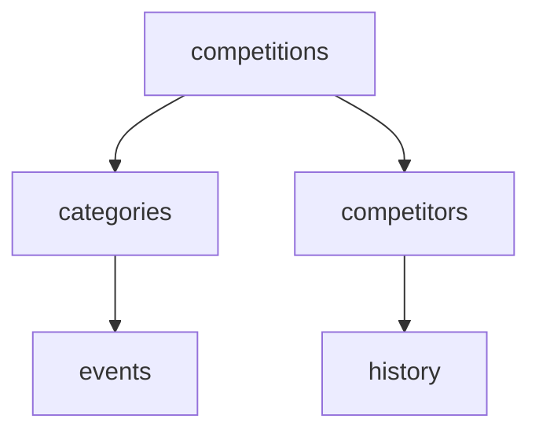

# Athletics.app API

## Table of Contents

- [Guidelines](#guidelines)
- [HTTP Methods Legend](#http-methods-legend)
- [Endpoints](#endpoints)
  - [Users](#endpoint-users)
  - [Clubs](#endpoint-clubs)
  - [Competitions](#endpoint-competitions)
  - [Teams](#endpoint-teams)
  - [Media](#endpoint-media)
  - [Stats](#endpoint-stats)
  - [Notifications](#endpoint-notifications)
  - [Search](#endpoint-search)
  - [Athletes](#endpoint-athletes)
  - [Auth](#endpoint-auth)
- [Mermaid Diagram](#mermaid-diagram)

## Guidelines

### 1. General Guidelines

- **Endpoint naming:** Use clear, consistent, and RESTful endpoint names. Prefer plural nouns (`/competitions/`, `/athletes/`) and hierarchical structure (`/competitions/{id}/categories/{category_id}/events/`).
- **HTTP methods:** Use the correct method according to the action.
- **Descriptions:** Provide a short, clear description of the endpoint. Include any important details, such as query parameters or filters.
- **Documentation updates:** If you change a description, add parameters, or modify an endpoint in any way, update the Contributor column. _Contributor: John_
- **Language:** All descriptions, comments, and documentation in this repository must be written in **English**, because contributors are from different countries.
- **Questions / clarification:** If an endpoint is unclear, open a GitHub issue and tag the contributor.
- **Consistency:** Keep format consistent across all endpoints (tables, headings, examples).

### 2. Contributor Guidelines

- **New endpoints:** Add your name in the Contributor column when you create a new endpoint.
- **Modifications:** If you edit an endpoint description, method, or parameters, also add your name in the Contributor column.
- **Multiple contributors:** List multiple names separated by commas, e.g., `John, Jane`.
- **Responsibility:** The Contributor column helps track who initially proposed or last updated an endpoint, so that questions can be directed to the right person if an endpoint is unclear.

### 3. Table of Contents Guidelines

- Make sure the TOC reflects **all sections**.
- Use markdown links to allow easy navigation, e.g., `[Users](#endpoint-users)`.
- Update the TOC whenever new sections or endpoints are added to the README.

## HTTP Methods Legend

| Method   | Description                                                                                       |
| -------- | ------------------------------------------------------------------------------------------------- |
| `GET`    | Retrieve data. Use this method to request information from the server without making any changes. |
| `POST`   | Create new data. Use this method to create a new item or record.                                  |
| `PUT`    | Update existing data. Use this method to fully update an existing item.                           |
| `DELETE` | Delete data. Use this method to remove an item from the server.                                   |

## Endpoints

#### Endpoint `users`

| Endpoint                           | Method               | Description                     | Contributor   |
| ---------------------------------- | -------------------- | ------------------------------- | ------------- |
| /users/                            | `GET` `POST`         | List of users / create new user | athletics.app |
| /users/{user_id}/                  | `GET` `PUT` `DELETE` | Specific user                   | athletics.app |
| /users/{user_id}/profile/          | `GET` `PUT`          | Personal profile information    | athletics.app |
| /users/{user_id}/preferences/      | `GET` `PUT`          | User settings / preferences     | athletics.app |
| /users/{user_id}/media/            | `GET` `POST`         | Upload/download user media      | athletics.app |
| /users/{user_id}/media/{media_id}/ | `GET` `DELETE`       | Individual media file           | athletics.app |

### Endpoint `clubs`

| Endpoint                                                   | Method               | Description                                                                     | Contributor   |
| ---------------------------------------------------------- | -------------------- | ------------------------------------------------------------------------------- | ------------- |
| /clubs/                                                    | `GET` `POST`         | List of clubs / create new club                                                 | athletics.app |
| /clubs/{club_id}/                                          | `GET` `PUT` `DELETE` | Club details                                                                    | athletics.app |
| /clubs/{club_id}/members                                   | `GET`                | Members of the club                                                             | Victor        |
| /clubs/{club_id}/startdate/{start_date}/enddate/{end_date} | `GET`                | Registered athletes or results of athletes from a club with start and end dates | Victor        |

### Endpoint `competitions`

| Endpoint                                                                                                | Method               | Description                                                         | Contributor   |
| ------------------------------------------------------------------------------------------------------- | -------------------- | ------------------------------------------------------------------- | ------------- |
| /competitions/                                                                                          | `GET` `POST`         | List of competitions / create new competition                       | athletics.app |
| /competitions/{competition_id}/                                                                         | `GET` `PUT` `DELETE` | Specific competition                                                | athletics.app |
| /competitions/{competition_id}/categories/                                                              | `GET` `POST`         | Categories within a competition                                     | athletics.app |
| ../categories/{category_id}/                                                | `GET` `PUT` `DELETE` | Specific category                                                   | athletics.app |
| ../categories/{category_id}/events/                                         | `GET` `POST`         | Events within a category                                            | athletics.app |
| ../categories/{category_id}/events/{event_id}/                              | `GET` `PUT` `DELETE` | Specific event                                                      | athletics.app |
| ../categories/{category_id}/events/{event_id}/results/                      | `GET` `POST`         | Event results                                                       | athletics.app |
| ../categories/{category_id}/events/{event_id}/results/{result_id}/          | `GET` `PUT` `DELETE` | Individual result                                                   | athletics.app |
| ../categories/{category_id}/events/{event_id}/participants/                 | `GET` `POST`         | Event participants                                                  | athletics.app |
| ../categories/{category_id}/events/{event_id}/participants/{competitor_id}/ | `GET` `DELETE`       | Specific participant                                                | athletics.app |
| /competitions/{competition_id}/registration/                                                            | `GET` `POST`         | Registration overview / create new registration                     | athletics.app |
| /competitions/{competition_id}/registration/settings/                                                   | `GET` `PUT`          | Online entry settings, maximum # of athletes, available bib numbers | athletics.app |
| /competitions/{competition_id}/registration/discounts/                                                  | `GET` `POST`         | Discounts & codes                                                   | athletics.app |
| /competitions/{competition_id}/registration/payments/                                                   | `GET`                | Payment overview                                                    | athletics.app |
| /competitions/{competition_id}/timetable/                                                               | `GET` `PUT`          | Timetable management                                                | athletics.app |
| /competitions/{competition_id}/results/settings/                                                        | `GET` `PUT`          | Results settings                                                    | athletics.app |
| /competitions/{competition_id}/leaderboard/settings/                                                    | `GET` `PUT`          | Leaderboard settings                                                | athletics.app |
| /competitions/{competition_id}/print/diplomas/                                                          | `GET`                | Get a PDF file of diplomas (@TODO: this endpoint requires defining parameters) (Q: should we add this to the endpoint?)                                                     | athletics.app |
| /competitions/{competition_id}/print/startlists/                                                        | `GET`                | Get a PDF file of startlists (@TODO: this endpoint requires defining parameters) (Q: should we add this to the endpoint?)                                                    | athletics.app |
| /competitions/{competition_id}/print/bib-labels/                                                        | `GET`                | Get a PDF file of bib labels (Q: should we add this to the endpoint?)                                                   | athletics.app |
| /competitions/{competition_id}/print/results/                                                           | `GET`                | Get a PDF file of results  (@TODO: this endpoint requires defining parameters) (Q: should we add this to the endpoint?)                                                      | athletics.app |
| /competitions/{competition_id}/enter/results/                                                           | `GET` `POST` `DELETE`         | Enter results manually (Q: How should we handle this? should we use another endpoint?)                                              | athletics.app |
| /competitions/{competition_id}/narrowcasting/                                                           | `GET`                | Narrowcasting displays (@TODO: this needs a lot more endpoints, to link screens, etc)                                              | athletics.app |
| /competitions/{competition_id}/clubs/                                                                   | `GET`                | Clubs participating in the competition                              | athletics.app |
| /competitions/{competition_id}/permissions/                                                                  | `GET` `PUT` `DELETE` `POST`          | Rights management (who can edit/view what)                          | athletics.app |
| /competitions/{competition_id}/competitors/                                                             | `GET` `POST`         | List of competitors / create new competitor                         | athletics.app |
| /competitions/{competition_id}/competitors/{competitor_id}/                                             | `GET` `PUT` `DELETE` | Specific competitor                                                 | athletics.app |
| /competitions/{competition_id}/competitors/{competitor_id}/history/                                     | `GET`                | History of all changes made to this competitor                                                  | athletics.app |
| /competitions/{competition_id}/check-in/{athlete_id}                                                    | `POST`               | Check in of athletes                                                | Victor        |
| /competitions/{competition_id}/teams/                             | `GET` `POST`         | Teams within a competition | athletics.app |
| /competitions/{competition_id}/teams/{team_id}/                   | `GET` `PUT` `DELETE` | Team details                       | athletics.app |
| /competitions/{competition_id}/teams/{team_id}/members/           | `GET` `POST`         | Team members                       | athletics.app |
| /competitions/{competition_id}/teams/{team_id}/members/{user_id}/ | `GET` `DELETE`       | Individual team member (should we do this, or should we just query a competitor?)             | athletics.app |
| /competitions/{competition_id}/relayteams/                             | `GET` `POST`         | Relay teams within a competition | athletics.app |
| /competitions/{competition_id}/relayteams/{team_id}/                   | `GET` `PUT` `DELETE` | Relay teams details                       | athletics.app |
| /competitions/{competition_id}/relayteams/{team_id}/members/           | `GET` `POST`         | Relay teams members                       | athletics.app |
| /competitions/{competition_id}/relayteams/{team_id}/members/{user_id}/ | `GET` `DELETE`       | Individual Relay teams member (should we do this, or should we just query a competitor?)             | athletics.app |

### Endpoint `media`

| Endpoint           | Method         | Description                   | Contributor   |
| ------------------ | -------------- | ----------------------------- | ------------- |
| /media/            | `GET` `POST`   | General media upload/download | athletics.app |
| /media/{media_id}/ | `GET` `DELETE` | Individual media file         | athletics.app |

### Endpoint `notifications`

| Endpoint                          | Method               | Description                                     | Contributor   |
| --------------------------------- | -------------------- | ----------------------------------------------- | ------------- |
| /notifications/                   | `GET` `POST`         | List of notifications / create new notification | athletics.app |
| /notifications/{notification_id}/ | `GET` `PUT` `DELETE` | Specific notification                           | athletics.app |

### Endpoint `athletes`

| Endpoint                        | Method | Description                                                             | Contributor |
| ------------------------------- | ------ | ----------------------------------------------------------------------- | ----------- |
| /athletes/{athlete_id}/results/ | `GET`  | All results for an athlete (filterable by season, discipline, location) | Victor      |
| /athletes/{athlete_id}/records/ | `GET`  | Personal records, season records, club records                          | Victor      |
| /athletes/{athlete_id}/events/  | `GET`  | Competitions for which the athlete is registered or has participated    | Victor      |

### Endpoint `auth`

Will be designed by Athletics.app

## Mermaid Diagram

