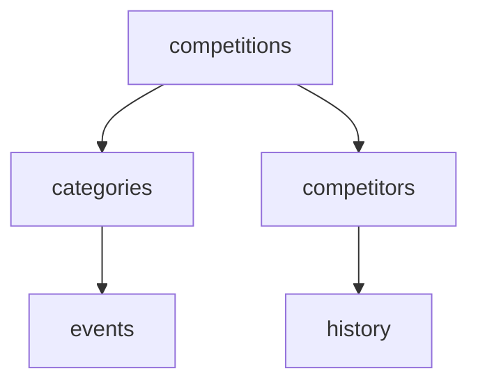

# Athletics.app API

## Table of Contents

- [Guidelines](#guidelines)
- [Contributing - New Endpoint Requests](#contributing---new-endpoint-requests)
- [Quick step-by-step guide for adding/updating an API resource](#quick-step-by-step-guide-for-addingupdating-an-api-resource)
- [Error responses](#error-responses)
- [Previewing the documentation](#previewing-the-documentation)
- [HTTP Methods Legend](#http-methods-legend)
- [Mermaid Diagram](#mermaid-diagram)

## Guidelines

### 1. General Guidelines

- **Endpoint naming:** Use clear, consistent, and RESTful endpoint names. Prefer plural nouns (`/competitions/`, `/athletes/`) and hierarchical structure (`/competitions/{id}/categories/{category_id}/events/`).
- **HTTP methods:** Use the correct method according to the action.
- **Descriptions:** Provide a short, clear description of the endpoint. Include any important details, such as query parameters or filters.
- **Documentation updates:** Keep `openapi.yaml` as the source of truth. If you change a description, add parameters, modify a schema, or add an endpoint, update `openapi.yaml` in the same change.
- **Language:** All descriptions, comments, and documentation in this repository must be written in **English**, because contributors are from different countries.
- **Questions / clarification:** If an endpoint is unclear, open a GitHub issue and tag the contributor.
- **Consistency:** Keep the OpenAPI structure consistent across all endpoints (operation IDs, parameters, responses, schemas, examples, and naming).

### 2. Contributor Guidelines

- **New endpoints:** Add the new path, operation, parameters, responses, and schemas to `openapi.yaml`.
- **Modifications:** If you edit an endpoint description, method, parameters, response, or schema, update the matching OpenAPI section.
- **Responsibility:** Use GitHub issues and pull requests to track who proposed, designed, reviewed, or changed an endpoint.

## Contributing - New Endpoint Requests

If you **don’t have API design experience**, please **do not add or modify endpoints directly**.

Instead, create a **New Endpoint Request** issue:

- Go to **Issues → New Issue → New Endpoint Request**
- Fill in the form with all the required details (purpose, method, body, etc.)
- The issue will be automatically assigned to RecourVictor, who will design and add the endpoint following the repository standards.

> This ensures consistency, proper naming, and a complete OpenAPI specification.

## Quick step-by-step guide for adding/updating an API resource

### 1) Update `openapi.yaml`

- Add or update the path under `paths`.
- Use a clear `operationId`.
- Add tags, summary, description, security, parameters, request body, and responses as needed.
- Keep path and field names in `snake_case`.

### 2) Define or reuse schemas

- Add reusable response and request models under `components.schemas`.
- Reuse existing schemas with `$ref` and `allOf` where possible.
- Keep pagination responses consistent with `PaginationMeta`.
- Add examples to make the generated Redoc documentation readable.

### 3) Document errors

- Add relevant `4XX` responses for invalid parameters, missing resources, or unauthorised requests.
- Add `429 Too Many Requests` for rate-limited endpoints.
- Add `5XX` responses only when they represent useful API behaviour for consumers. Use `500 Internal Server Error` for unexpected server-side failures.
- Use the shared `Error` schema unless the endpoint needs a more specific error shape.
- Do not add blanket auth errors to public endpoints that define `security: []`.

### 4) Validate the OpenAPI file

- Run the OpenAPI linting locally before opening a pull request:

```bash
node scripts/lint-openapi.mjs
```

- Pull requests run the same lint in GitHub Actions. The lint fails on both errors and warnings.

## Error responses

The OpenAPI file defines a shared `Error` schema with a `message` field. Reuse the shared response components where they fit:

- `BadRequest` (`400`) for invalid request parameters or malformed request data.
- `NotFound` (`404`) when the addressed resource does not exist.
- `TooManyRequests` (`429`) when the documented rate limit is exceeded.
- `InternalServerError` (`500`) for unexpected server-side failures.

Document only the errors that apply to the endpoint. For example, public endpoints should not list authentication errors unless the operation actually requires authentication.

## Previewing the documentation

The rendered API documentation is generated from `openapi.yaml` with Redoc.

Build a local preview file:

```bash
npx --yes @redocly/cli build-docs openapi.yaml --output redoc-preview.html --title "Athletics.app API Docs"
```

Then open `redoc-preview.html` in a browser.

The generated `redoc-preview.html` file is ignored by git. Keep `openapi.yaml` as the source of truth.

Pull requests run the same Redoc build in GitHub Actions and upload `redoc-preview.html` as a workflow artifact.

## HTTP Methods Legend

| Method   | Description                                                                                       |
| -------- | ------------------------------------------------------------------------------------------------- |
| `GET`    | Retrieve data. Use this method to request information from the server without making any changes. |
| `POST`   | Create new data. Use this method to create a new item or record.                                  |
| `PUT`    | Update existing data. Use this method to fully update an existing item.                           |
| `DELETE` | Delete data. Use this method to remove an item from the server.                                   |

## Mermaid Diagram


