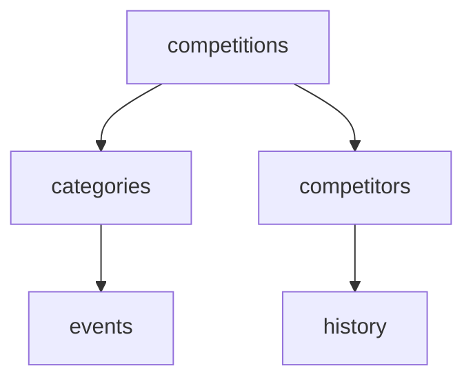

# Athletics.app API

## Table of Contents

- [Guidelines](#guidelines)
- [Contributing - New Endpoint Requests](#contributing---new-endpoint-requests)
- [Quick step-by-step guide for adding/updating an API resource](#quick-step-by-step-guide-for-addingupdating-an-api-resource)
- [HTTP Methods Legend](#http-methods-legend)
- [Mermaid Diagram](#mermaid-diagram)

## Guidelines

### 1. General Guidelines

- **Endpoint naming:** Use clear, consistent, and RESTful endpoint names. Prefer plural nouns (`/competitions/`, `/athletes/`) and hierarchical structure (`/competitions/{id}/categories/{category_id}/events/`).
- **HTTP methods:** Use the correct method according to the action.
- **Descriptions:** Provide a short, clear description of the endpoint. Include any important details, such as query parameters or filters.
- **Documentation updates:** If you change a description, add parameters, or modify an endpoint in any way, update the Contributor column. _Contributor: John_
- **Language:** All descriptions, comments, and documentation in this repository must be written in **English**, because contributors are from different countries.
- **Questions / clarification:** If an endpoint is unclear, open a GitHub issue and tag the contributor.
- **Consistency:** Keep format consistent across all endpoints (tables, headings, examples).

### 2. Contributor Guidelines

- **New endpoints:** Add your name in the Contributor column when you create a new endpoint.
- **Modifications:** If you edit an endpoint description, method, or parameters, also add your name in the Contributor column.
- **Multiple contributors:** List multiple names separated by commas, e.g., `John, Jane`.
- **Responsibility:** The Contributor column helps track who initially proposed or last updated an endpoint, so that questions can be directed to the right person if an endpoint is unclear.

## Contributing - New Endpoint Requests

If you **don’t have API design experience**, please **do not add or modify endpoints directly**.

Instead, create a **New Endpoint Request** issue:

- Go to **Issues → New Issue → New Endpoint Request**
- Fill in the form with all the required details (purpose, method, body, etc.)
- The issue will be automatically assigned to RecourVictor, who will design and add the endpoint following the repository standards.

> This ensures consistency, proper naming, and correct DTO integration.

## Quick step-by-step guide for adding/updating an API resource

### 1) Create the resource file

- In the repo create a file:
  docs/{resource}.md
  > use lowercase plural for the filename (e.g. users.md, competitions.md).
- The first line must be an H1 with the resource name in Title Case:

```
# Users
```

### 2) Add endpoints using the standard endpoint block

- For each endpoint in that resource, paste the endpoint template and adapt it.
- Group related endpoints together (GET / POST / PUT / DELETE for the same path).

Template to copy into docs/{resource}.md:

```
## `GET` /users/

| Method | Authorisation | Contributor   |
| ------ | ------------- | ------------- |
| `GET`  | Yes           | YOURNAMEHERE  |

### Description
Retrieve all users.

### Query parameters
- `?page` (integer) — optional
- `?limit` (integer) — optional
- `?sort` (string) — optional, e.g. `?sort=last_name_asc`

### Body
_None_

### Response
Path: dto/users/userget.json
```

- Replace method/path/authorisation/contributor/description/query params/body/response links as needed.
- Repeat block for each endpoint in that resource file.

> **Note:** The JSON response block is automatically generated from the corresponding DTO file (`dto/{resource}/{filename}.json`) whenever a commit is made. You do **not** need to manually paste JSON into the Markdown.

### 3) DTOs: where & how to create them

- Create a folder for the resource’s DTOs:
  `dto/{resource}/`
  (e.g. docs/dtos/users/)
- Name each DTO file descriptively. Example naming convention:
  - userget.json → DTO used by GET user responses
  - userpost.json → DTO for POST /users request body
- DTO file format: JSON Schema (recommended) or a simple typed JSON.

### 4. Nesting DTOs (how to reference other DTOs)

In documentation you can show nesting by referencing the DTO name (not necessarily $ref syntax). For the live API we will expand to full objects, but for doc clarity this shorthand is allowed.

Example DTO that nests a club DTO by the DTO path:

```
{
  "club": "Path:../clubs/clubget.json"
}
```

club: "Path:../clubs/clubget.json" means: use the DTO file `dto/clubs/clubget.json` for the club object.

### 5. Grouping & layout advice

Keep a single resource per `docs/{resource}.md` file.

Within that file, group endpoints logically: collection endpoints first (/users/), then resource endpoints (/users/{id}/), then sub-resources (/users/{id}/profile/, /users/{id}/media/).

For complex resources, use subheadings per endpoint group (e.g., ### Authentication, ### Media, ### Admin-only).

## HTTP Methods Legend

| Method   | Description                                                                                       |
| -------- | ------------------------------------------------------------------------------------------------- |
| `GET`    | Retrieve data. Use this method to request information from the server without making any changes. |
| `POST`   | Create new data. Use this method to create a new item or record.                                  |
| `PUT`    | Update existing data. Use this method to fully update an existing item.                           |
| `DELETE` | Delete data. Use this method to remove an item from the server.                                   |

## Mermaid Diagram


